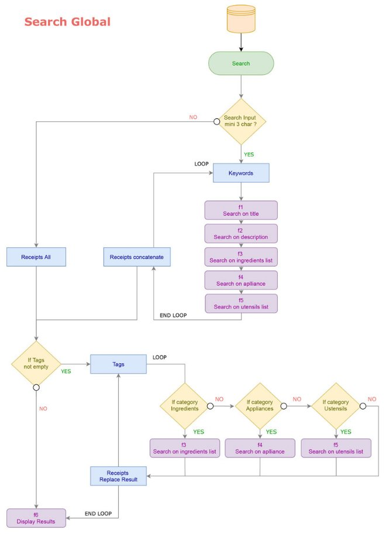
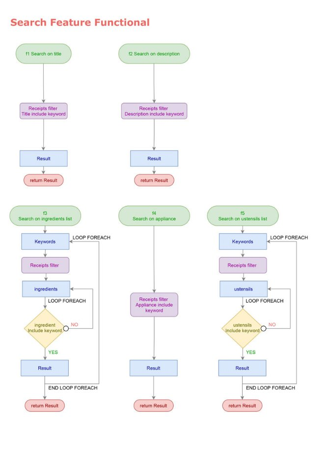
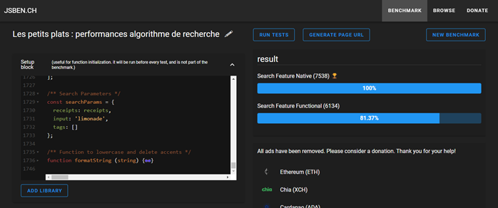
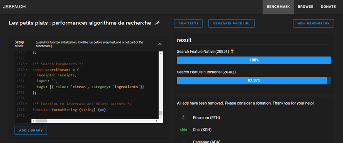
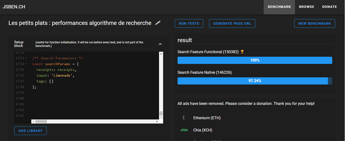
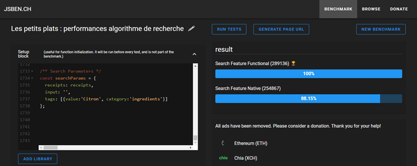
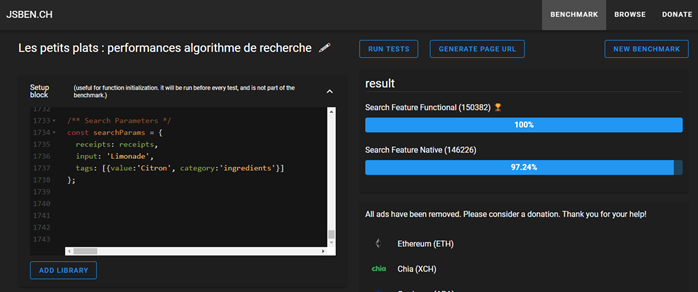

# Fiche d’investigation de fonctionnalité
**Problématique :** 
Deux approches différentes pour l’algorithme de recherche. Une approche native avec boucle **for**, et une approche fonctionnelle avec les méthodes **filter** et **forEach**. Il faut trouver l’algorithme la plus rapide entre les deux approches.

| **Option 1 : Search Feature Native** |
| :- |
Utilise les boucles for pour chaque mot clé renseigné dans le champ. Une autre boucle for est utilisé pour parcourir les recettes et vérifier la correspondance avec le titre, la description, les ingrédients, les appareils et les ustensils. Une fois tous les mots clés analysés, le tableau est filtré pour supprimer les doublons présents dans le tableau de résultat.|

| Avantages | Inconvenient |
| :- | :- | 
| Rapidité d’exécution | Code peu lisible et peu maintenable |

|N| Utilisation|
| :- | :- | 
**Cas n 1** | L’utilisateur remplis uniquement le champ de recherche
**Cas n 2** | L’utilisateur laisse le champ de recherche vide et sélectionne un tag
**Cas n 3** | L’utilisateur sélectionne un tag et remplis le champ de recherche

| **Option 2 : Search Feature Functional** |
| :- |
Utilise les boucles forEach pour chaque mot clé renseigné dans le champ. Un filtre avec la méthode filter est utilisé sur les recettes pour vérifier la correspondance avec le titre, la description, les ingrédients, les appareils et les ustensils. Une fois tous les mots clés analysés le tableau est filtré pour supprimer les doublons présents dans le tableau de résultat.|

| Avantages | Inconvenient |
| :- | :- | 
| Lisibilité du code | Utilise plus de ressources |

|N| Utilisation|
| :- | :- | 
**Cas n 1** | L’utilisateur remplis uniquement le champ de recherche
**Cas n 2** | L’utilisateur laisse le champ de recherche vide et sélectionne un tag
**Cas n 3** | L’utilisateur sélectionne un tag et remplis le champ de recherche

|Solution retenue|
|:-|
|Aux vues des résultats et la cible étant la performance, j’ai choisi l’option 1 pour le système de recherche. La fonction formatString fait largement chuter l’indice de performance global. Cependant, il me parait plus judicieux de proposer aux utilisateurs un système de recherche plus pertinent. En effet, dans les cas pratiques, le fait d’inclure les erreurs d’accents et l’absence de majuscules dans la barre de recherche permet de proposer un résultat plus fiable.|

## Annexes 
### **Exemple : Data d’une recette**
Les recettes sont stockées dans une variable **receipts** dans laquelle on trouve 50 recettes.
```js
  {
    id: 1,
    name: 'Limonade de Coco',
    image: 'limonade-de-coco.jpg',
    servings: 1,
    ingredients: [{
      ingredient: 'Lait de Coco',
      quantity: 400,
      unit: 'ml'
    },{
      ingredient: 'Jus de citron',
      quantity: 2
    },{
      ingredient: 'Crème de coco',
      quantity: 2,
      unit: 'cuillères à soupe'
    },{
      ingredient: 'Sucre',
      quantity: 30,
      unit: 'grammes'
    },{
      ingredient: 'Glaçons'
    }
    ],
    time: 10,
    description: "Mettre les glaçons à votre goût dans le blender, ajouter le lait, la crème de coco, le jus de 2 citrons et le sucre. Mixer jusqu'à avoir la consistence désirée",
    appliance: 'Blender',
    ustensils: ['Cuillère à soupe', 'Verres', 'Presse citron']
  },
```
### **Fonction commune aux deux algorithmes**

La fonction **formatString** permet de supprimer les accents et de mettre tous les caractères en minuscules. Le but est de proposer un résultat même si l’utilisateur oublie les accents ou s’il ne saisit aucune majuscule.

```js
/** Function to lowercase and delete accents */
function formatString (string) {
  let formatString = string.toLowerCase();
  formatString = formatString.replace(/[éèêë]/g, 'e');
  formatString = formatString.replace(/[àâ]/g, 'a');
  formatString = formatString.replace(/[ùû]/g, 'u');
  formatString = formatString.replace(/[îï]/g, 'i');
  formatString = formatString.replace(/[ç]/g, 'c');

  return formatString;
}
```

### **Description des deux algorithmes de recherches**
**Algorithmes utilisant les boucles natives for :** 
Le principe est de faire une boucle **for** sur chaque mot clé pour rechercher une correspondance sur le titre, la description, les ingrédients, les appareils et les ustensiles. Une boucle **for** sur toutes les recettes renvois une correspondance trouvée et l’ajoute au tableau de résultat. Chaque tag sont considérés comme des mots clés et sont prioritaires sur le résultat de la recherche.

*(figure 1 - 2)*

**Algorithmes utilisant une approche fonctionnelle :**
Le principe est de faire une boucle **forEach** sur chaque mot clé pour rechercher une correspondance sur le titre, la description, les ingrédients, les appareils et les ustensiles. La méthode **filter** sur chaque recette renvois une correspondance et l’ajoute au tableau de résultat. Chaque tag sont considérés comme des mots clés et sont prioritaires sur le résultat de la recherche.

*(figure 1 - 3)*

**Figure 1 - Algorigramme**  
  
**Figure 2 - Algorigramme**  
  
**Figure 3 - Algorigramme**  
  

#### **Paramètres de recherche avec 3 cas d’utilisation**
**1er cas d’utilisation** : on renseigne le champ de recherche sans tag
```js
/** Search Parameters */
const searchParams = {
  receipts: receipts,
  input: 'limonade',
  tags: []
};
```
**2ème cas d’utilisation** : le champ de recherche est vide et un tag est sélectionné
```js
/** Search Parameters */
const searchParams = {
  receipts: receipts,
  input: '',
  tags: [{
    value: 'citron',
    category: 'ingredients'
  }]
};
```
**3ème cas d’utilisation** : le champ de recherche est renseigné avec un tag sélectionné
```js
/** Search Parameters */
const searchParams = {
  receipts: receipts,
  input: 'limonade',
  tags: [{
    value: 'citron',
    category: 'ingredients'
  }]
};
```

#### **Résultats des performances (JSBEN.CH):**

J’ai effectué des tests pour les 3 cas d’usage de la recherche avancée. La fonction **formatString** prend de la ressource, c’est pourquoi j’ai testé l’algorithme avec et sans cette fonction. 

|||**CAS N1**|**CAS N2**|**CAS N3**|**Moyenne**|
| :- | :- | :-: | :-: | :-: | :-: |
|**V1**|Algo boucle native|**7538 (100%)**|**20851 (100%)**|**7361 (100%)**|**100%**|
|**V2**|Algo fonctionnel|6134 (81.37%)|20302 (97.37%)|6042 (82.08%)|**86.94%**|
|**V1**|Algo boucle native (sans formatString)|**150382 (100%)**|**289136(100%)**|**150382(100%)**|**100%**|
|**V2**|Algo fonctionnel (sans formatString)|146226(97.24%)|254867(88.15%)|146226(97.24%)|**94.21%**|

Pour les tests avec la fonction **formatString** on remarque une nette différence de **13.06%** de performance entre l’algorithme en boucle native et l’algorithme fonctionnel. Sans cette fonction on passe à une différence mineure de **5.79%** de performances. Cependant **l’algorithme de l’option 1 est plus performant** avec ou sans la fonction.

**CAS N1**  
  
**CAS N2**  
  
**CAS N3**  
  
**CAS N1 (sans fonction formatString)**  
  
**CAS N2 (sans fonction formatString)**   
  
**CAS N3 (sans fonction formatString)**    
  
